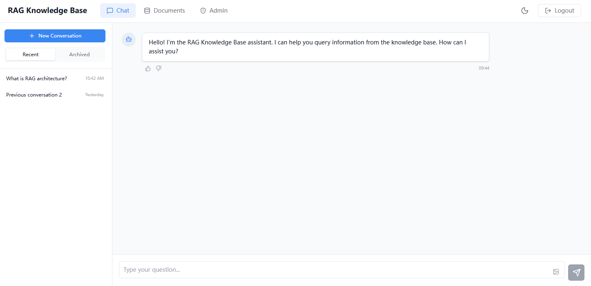
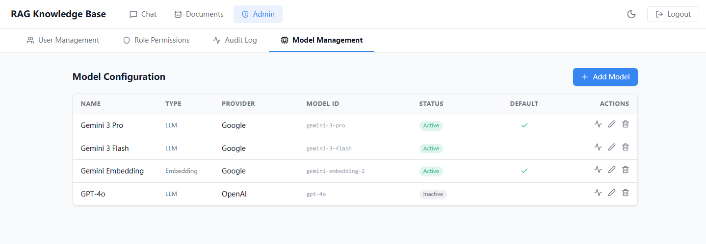
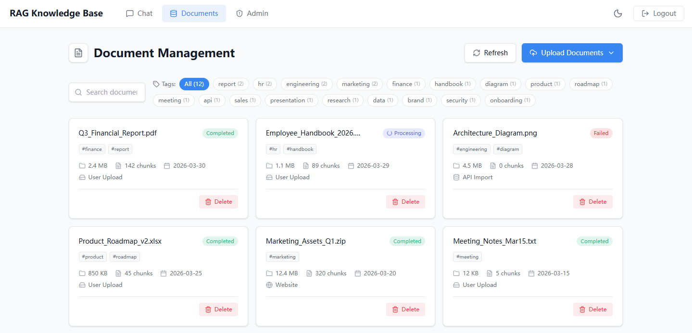

# RAG Knowledge Base System

Enterprise-grade Retrieval-Augmented Generation (RAG) system built with FastAPI, Milvus, and LangChain. Supports multi-tenant document management, hybrid retrieval, streaming responses, and Kubernetes-native deployment.

## Features

- **Document Processing** — Parse PDF, Word, Markdown, and TXT files with configurable chunking strategies
- **Hybrid Retrieval** — Combine BM25 keyword search with Milvus vector similarity, fused via Reciprocal Rank Fusion (RRF)
- **Multi-Tenant Isolation** — Partition-based tenant isolation in Milvus with tenant-aware metadata in PostgreSQL
- **Streaming Responses** — Real-time token streaming for interactive Q&A experience
- **Conversation Management** — Persistent chat history with auto-generated titles and tagging
- **Document Review Workflow** — Multi-stage review pipeline with task assignment and batch operations
- **User Feedback System** — Rating, comment, and low-score alerting for answer quality tracking
- **Model Configuration** — Dynamic LLM and embedding model switching via database-backed configuration
- **Answer Caching** — Redis-backed semantic answer caching with optional warmup on startup
- **Security** — JWT authentication, role-based access control (RBAC), PII detection, and sensitive content filtering
- **Observability** — Prometheus metrics, structured logging, and audit trail for all operations
- **Kubernetes Ready** — Full K8s manifests with HPA autoscaling, ConfigMaps, Secrets, and monitoring stack

## UI

<div align="center">
  
  
  
</div>

## Architecture

```
┌─────────────────────────────────────────────────────────────────┐
│                        Client / Frontend                        │
└────────────────────────────┬────────────────────────────────────┘
                             │ HTTP / SSE
┌────────────────────────────▼────────────────────────────────────┐
│                     FastAPI (RAG API)                           │
│  ┌──────────┐ ┌──────────┐ ┌──────────┐ ┌───────────────────┐   │
│  │   Auth   │ │  Users   │ │Documents │ │  Conversations    │   │
│  └──────────┘ └──────────┘ └──────────┘ └───────────────────┘   │
│  ┌──────────┐ ┌──────────┐ ┌──────────┐ ┌───────────────────┐   │
│  │  Query   │ │  Review  │ │ Feedback │ │  Model Config     │   │
│  └──────────┘ └──────────┘ └──────────┘ └───────────────────┘   │
└────────────┬──────────────────────────┬─────────────────────────┘
             │                          │
┌────────────▼──────────┐  ┌────────────▼────────────────────────┐
│    Core Services      │  │        External Services            │
│ ┌───────────────────┐ │  │  ┌──────────────────────────────┐   │
│ │ Document Processor│ │  │  │  Milvus (Vector DB)          │   │
│ │ Embedding Service │ │  │  │  PostgreSQL (Metadata)       │   │
│ │ Retriever (Hybrid)│ │  │  │  Redis (Cache)               │   │
│ │ Reranker          │ │  │  │  MinIO (Object Storage)      │   │
│ │ LLM Service       │ │  │  │  LLM API (GLM-4 / OpenAI)    │   │
│ │ Stream Service    │ │  │  │                              │   │
│ │ Cache Service     │ │  │  │                              │   │
│ │ PII Detector      │ │  │  │                              │   │
│ │ Sensitive Filter  │ │  │  │                              │   │
│ └───────────────────┘ │  │  └──────────────────────────────┘   │
└───────────────────────┘  └─────────────────────────────────────┘
```

## Tech Stack

| Category | Technology |
|---|---|
| **Framework** | FastAPI 0.104+, Uvicorn, Pydantic 2.5+ |
| **LLM Orchestration** | LangChain 0.1+, LangGraph |
| **Vector Database** | Milvus 2.3+ |
| **Relational DB** | PostgreSQL (via SQLAlchemy 2.0+) |
| **Cache** | Redis 5.0+ |
| **Object Storage** | MinIO |
| **Embedding** | BGE-M3 / OpenAI-compatible APIs |
| **Retrieval** | BM25 (rank-bm25) + Jieba (Chinese segmentation) |
| **Authentication** | PyJWT (HS256) |
| **Monitoring** | Prometheus Client |
| **Deployment** | Kubernetes (HPA, ConfigMap, Secrets) |
| **Python Version** | 3.11+ |

## Quick Start

### Prerequisites

- Python 3.11+
- PostgreSQL, Redis, Milvus, MinIO (or use the K8s manifests)

### 1. Install Dependencies

```bash
cd backend
pip install -r requirements.txt
# or with Poetry
poetry install
```

### 2. Configure Environment

```bash
cp .env.example .env
# Edit .env with your actual credentials
```

Key environment variables:

| Variable | Description | Default |
|---|---|---|
| `OPENAI_API_KEY` | LLM API key | — |
| `OPENAI_API_BASE` | LLM API endpoint | `https://open.bigmodel.cn/api/paas/v4` |
| `POSTGRES_HOST` | PostgreSQL host | `localhost` |
| `REDIS_HOST` | Redis host | `localhost` |
| `MILVUS_HOST` | Milvus host | `localhost` |
| `MINIO_ENDPOINT` | MinIO endpoint | `localhost:9000` |
| `JWT_SECRET_KEY` | JWT signing key | — |
| `LLM_MODEL_NAME` | Default LLM model | `glm-4` |
| `EMBEDDING_MODEL_NAME` | Default embedding model | `embedding-3` |
| `CHUNK_SIZE` | Document chunk size | `500` |
| `TOP_K` | Retrieval top-k results | `5` |

### 3. Start the Server

```bash
cd backend
python -m app.main
# or
uvicorn app.main:app --host 0.0.0.0 --port 8000
```

Server will be available at `http://localhost:8000`.

### 4. API Documentation

Interactive API docs are available at:
- Swagger UI: `http://localhost:8000/docs`
- ReDoc: `http://localhost:8000/redoc`

## Kubernetes Deployment

### Prerequisites

- Kubernetes cluster (Minikube or production)
- Helm (optional, for Prometheus/Grafana)

### Deploy

```bash
# Apply secrets and configuration
kubectl apply -f k8s/secrets.yaml
kubectl apply -f k8s/configmap.yaml

# Deploy Milvus
kubectl apply -f k8s/deployments/milvus.yaml

# Deploy remaining services (rag-api deployment manifest required)
# kubectl apply -f k8s/deployments/rag-api.yaml

# Apply autoscaling
kubectl apply -f k8s/hpa.yaml

# Set up monitoring
kubectl apply -f k8s/prometheus-alerts.yaml
kubectl apply -f k8s/grafana-alertmanager-config.yaml
```

### Monitoring

The system exposes Prometheus metrics at `/metrics` including:
- Request rate, latency, and error rates
- Cache hit/miss ratios
- Active connection counts
- Vector store size
- Query success rates
- Document operation counts

Pre-configured alert rules cover error rates, latency thresholds, resource utilization, and pod health.

## Development

### Run Tests

```bash
cd backend
pytest
```

### Code Style

```bash
black backend/app/
flake8 backend/app/
```

## License

MIT
